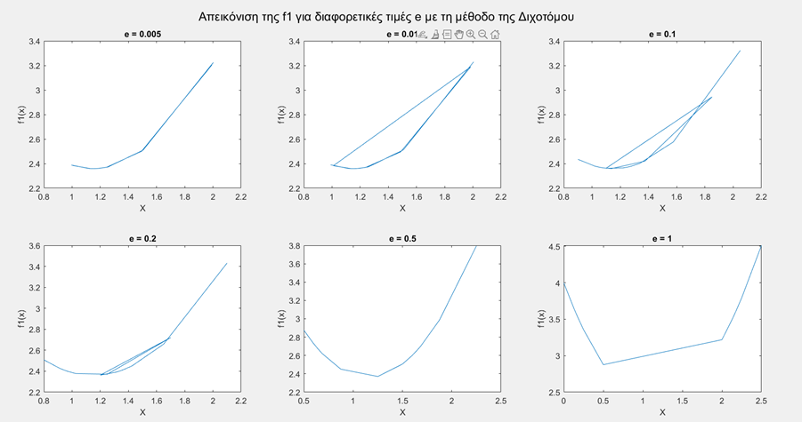
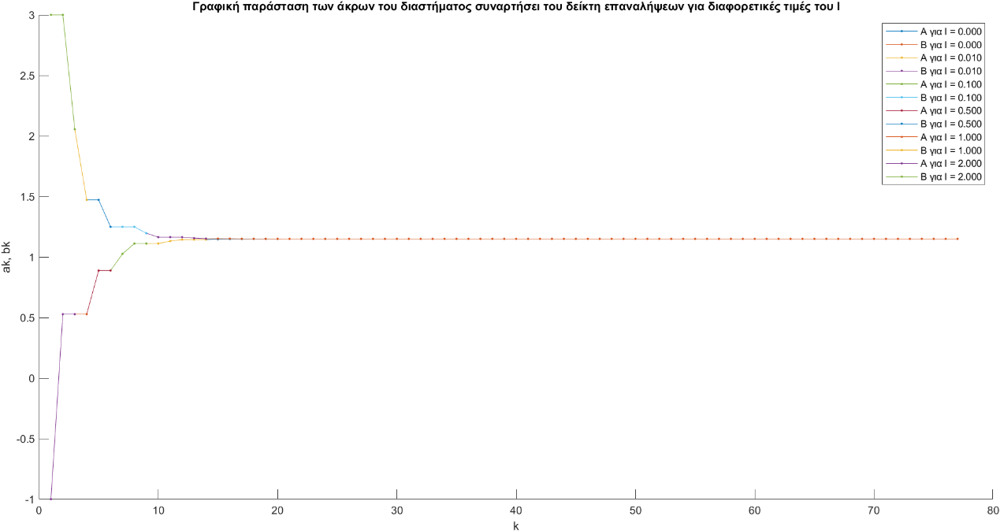
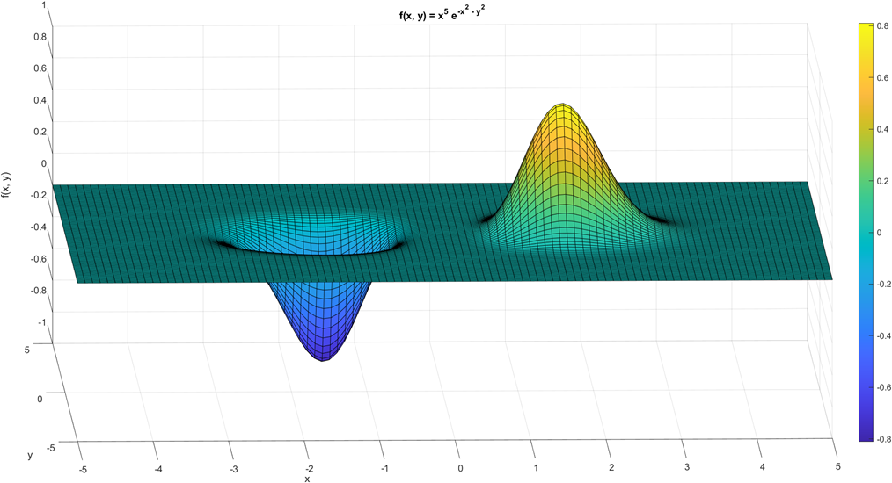
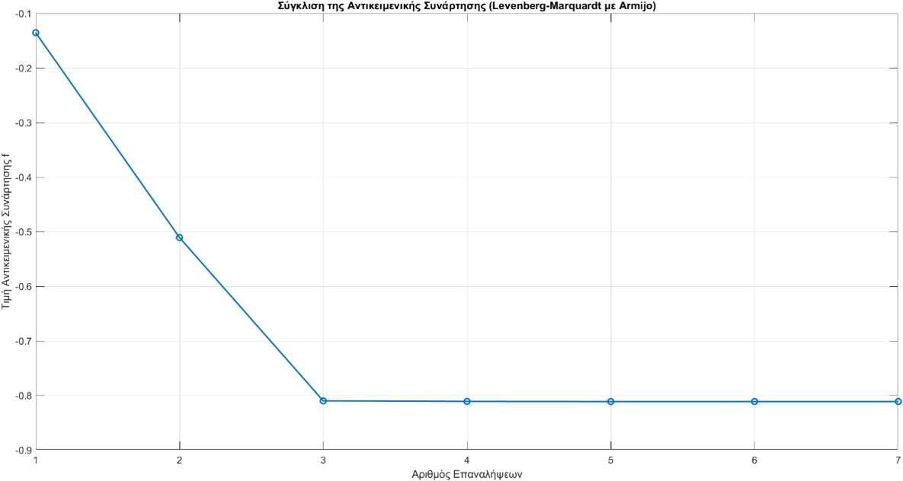

# Optimization Techniques | ECE AUTh

Implementation and analysis of optimization algorithms.

## 📦 Deliverable 1: Single-Variable Optimization

Implementation of the **Bisection** and **Golden Section** methods to find the minimum of non-linear functions within the interval $[-1, 4]$.

### 📊 Comparative Analysis & Key Findings

#### 1. Bisection Method
* **Termination Logic:** The algorithm successfully terminates only when $\epsilon < l/2$.
* **Efficiency:** For $l=0.01$ and $\epsilon=0.001$, it converges in 10 iterations with **18 function evaluations**.
* **Sensitivity:** Large $\epsilon$ values lead to numerical oscillations as shown in the analysis.

#### 2. Golden Section Search
* **Computational Cost:** Requires 14 iterations for $l=0.01$ but only **15 function evaluations**, making it ideal for "expensive" functions.
* **Behavior:** Shows a consistent "step-like" reduction of the uncertainty interval.

| Method | Accuracy ($l$) | Iterations ($k$) | Function Evaluations |
| :--- | :---: | :---: | :---: |
| **Bisection** | $0.01$ | 10 | 18 |
| **Golden Section** | $0.01$ | 14 | 15 |

---

## 📂 Repository Structure

The project is organized into folders per deliverable and sub-folders per objective function for clarity:

* 📂 **`Deliverable_1/`**:
    * 📂 `f1_Analysis/`: Scripts and function definitions for $f_1(x)$.
    * 📂 `f2_Analysis/`: Scripts and function definitions for $f_2(x)$.
    * 📂 `f3_Analysis/`: Scripts and function definitions for $f_3(x)$.
    * 📄 `Deliverable_1_Report.pdf`: Comprehensive technical report.
    * 📄 `Deliverable_1_Assignment.pdf`: The assignment of the first deliverable.
* 📂 **`Plots/`**: Selected visualizations for the README highlights.

## 📦 Deliverable 2: Multi-Variable Optimization

This deliverable explores second-order and gradient-based optimization methods, focusing on the impact of starting points, step-size strategies, and Hessian matrix properties.

### 📉 Objective Function Overview
A 3D surface analysis of the objective function revealed a global minimum at $\approx -0.8106$ and a stationary saddle point at $(0, 0)$.

### 🚀 Comparison of Methods & Strategies

The performance was evaluated using three primary starting points:
* **(i) (0, 0):** Stationary point trap.
* **(ii) (-1, 1):** Vicinity of the global minimum.
* **(iii) (1, -1):** Remote point, prone to saddle point capture.

#### 1. Steepest Descent (Gradient Descent)
* **Finding:** Constant step size is inefficient. The **Optimal Step** (via Bisection) and **Armijo Rule** showed superior performance, reaching the minimum in **7-8 iterations** from point (ii).
* **Trap Escape:** For point (iii), increasing the search space for $\gamma$ from $[0, 1]$ to $[0, 4]$ was necessary to escape the $(0, 0)$ attractor.

#### 2. Newton's Method
* **Limitation:** Highly unstable in non-convex regions. Due to **negative definite Hessians**, the method consistently failed to reach the global minimum from points (ii) and (iii), converging instead to the saddle point.
* **Key Insight:** Newton's method reached the minimum in only **4 iterations** but only when initialized in a strictly convex region (e.g., -1.5, 0.5).

#### 3. Levenberg-Marquardt (L-M)
* **Optimization:** The most robust method. By ensuring a positive definite Hessian ($\nabla^2 f + \mu I$), it successfully navigated to the global minimum.
* **Peak Efficiency:** Combined with the **Armijo Rule**, L-M achieved convergence in just **6 iterations**.

### 📊 Comparative Performance Summary (Point ii)
| Method | Step Strategy | Iterations | Status |
| :--- | :--- | :---: | :---: |
| **Steepest Descent** | Optimal $\gamma_k$ | 7 | ✅ Success |
| **Newton** | Fibonacci Search | 9548 | ❌ Trapped |
| **Levenberg-Marquardt**| Armijo Rule | **6** | ✅ Optimal |

---

## 📂 Repository Structure (Deliverable 2)

The implementation is modularized into sub-folders based on the optimization strategy:

* 📂 **`Deliverable_2/`**:
    * 📂 `Steepest_Descent/`: Gradient-based implementations (Constant, Optimal, Armijo).
    * 📂 `Newton_Method/`: Second-order implementations and stability analysis.
    * 📂 `Levenberg_Marquardt/`: Robust hybrid optimization scripts.
    * 📂 `Utils/`: Reusable line search routines (Armijo, Fibonacci, Bisection).
    * 📂 `Visualization/`: 3D surface plotting of the objective function.
    * 📄 `Deliverable_2_Report.pdf`: Comprehensive technical analysis.
    * 📄 `Deliverable_2_Assignment.pdf`: The objectives of this deliverable.
---
## 📦 Deliverable 3: Constrained Optimization (Projected Gradient)

The final deliverable focuses on the **Projected Gradient Descent** method for minimizing the function $f(x) = \frac{1}{3}x_1^2 + 3x_2^2$ under box constraints: $-10 \leq x_1 \leq 5$ and $-8 \leq x_2 \leq 12$.

### 📉 Unconstrained vs. Constrained Descent
The study begins by analyzing simple Gradient Descent. Mathematical proof and simulations show that convergence is strictly dependent on the step size $\gamma$:
* **Convergence:** Observed for $\gamma = 0.1$ and $\gamma = 0.3$.
* **Divergence:** For $\gamma = 3$ and $\gamma = 5$, the function values tend to infinity ($f \to \infty$).

### 🚀 Projected Gradient Method Analysis
The core of the study explores the interaction between the descent step ($\gamma_k$) and the projection step ($s_k$). 

#### 1. The Oscillation Trap ($\gamma_k=0.5, s_k=5$)
In this scenario, the algorithm fails to converge to the global minimum (0,0). 
* **Behavior:** While $x_1$ vanishes quickly, $x_2$ becomes trapped in an oscillation between $5.333$ and $-1.333$.
* **Insight:** The product $\gamma_k \cdot s_k$ leads to a cycle where the projection step constantly overshoots the minimum, resulting in two distinct alternating values for $f$.

#### 2. Near-Convergence via Step Reduction ($\gamma_k=0.1, s_k=15$)
By reducing $\gamma_k$ and increasing $s_k$, the oscillation range for $x_2$ narrows significantly. 
* **Result:** Although $x_2$ technically still oscillates, the values become sufficiently small ($\approx 10^{-3}$), allowing the algorithm to return a result very close to the global minimum within 1308 iterations.

#### 3. Guaranteed Convergence ($\gamma_k=0.2, s_k=0.1$)
This configuration satisfies the stability criterion $\gamma_k \cdot s_k < 0.33$.
* **Result:** The algorithm converges smoothly to (0,0) in 448 iterations without any oscillations. 
* **Observation:** Even starting from more remote initial points, the proper selection of steps ensures a steady downward trajectory for $f(x)$.

*Figure: Comparison of convergence paths. Note how small step products eliminate the "ping-pong" effect of the projection.*

| Scenario | $\gamma_k$ | $s_k$ | $\gamma_k \cdot s_k$ | Result |
| :--- | :---: | :---: | :---: | :--- |
| **Theme 2** | 0.5 | 5 | 2.5 | ❌ Oscillation |
| **Theme 3** | 0.1 | 15 | 1.5 | ⚠️ Numerical Convergence |
| **Theme 4** | 0.2 | 0.1 | 0.02 | ✅ Smooth Convergence |

---

## 📂 Repository Structure (Deliverable 3)

* 📂 **`Deliverable_3/`**: 
    * 📄 `Ex_1.m`: Unconstrained gradient descent study.
    * 📄 `Ex_2_3_4.m`: Comparative study of Projected Gradient Descent.
    * 📄 `Ex_i.m`: Individual test script for parameter exploration.
    * 📄 `Deliverable_3_Report.pdf`: Detailed mathematical proofs and oscillation analysis.

---
*Project developed as part of the Optimization Techniques course, ECE AUTh, 2026.*
